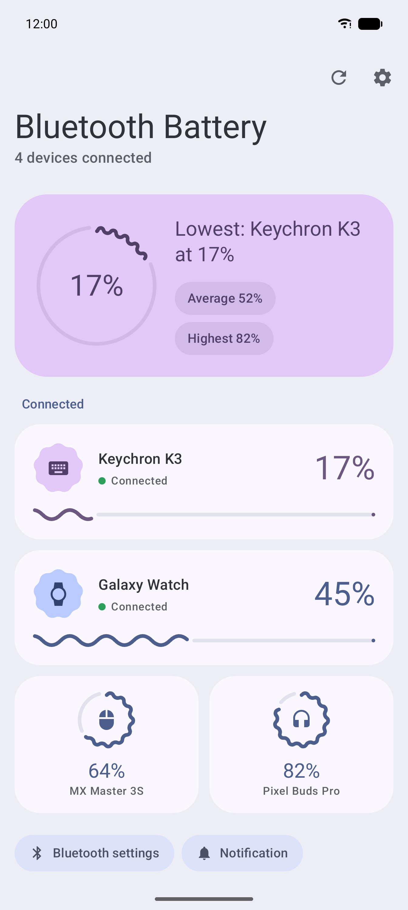
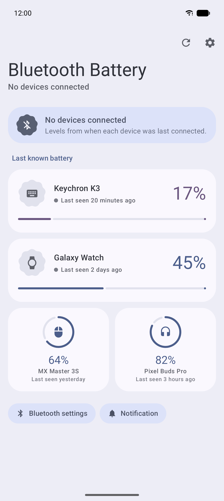
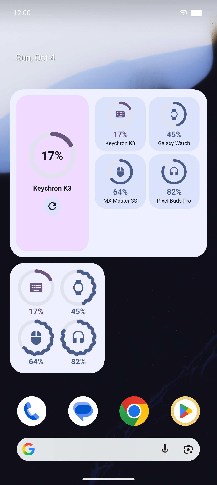
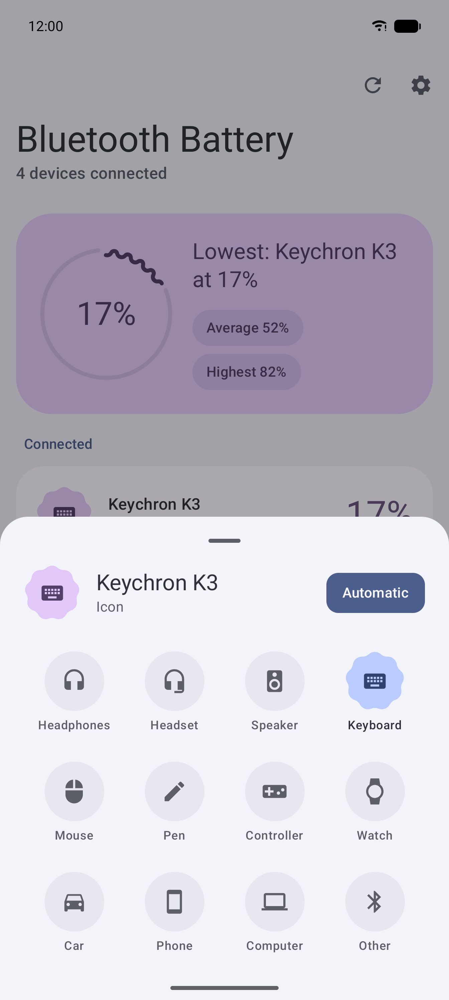

# 🔋 UniBattery


**One widget for the battery level of all your Bluetooth devices.**

Headphones, mouse, keyboard, controller, watch: every one of them seems to want its own companion app just so you can see how much battery is left. Or you dig through Bluetooth settings every time. UniBattery shows them all in one place, so a quick look at your home screen is enough.

<p>
  
  
  
  
</p>

> [!NOTE]
> **This app is vibecoded.** It was built almost entirely by prompting an AI (Claude) rather than written by hand. It works for what I need, but don't treat it as production-quality code. Issues and PRs are welcome.

## ✨ Features

- 🏠 **Home-screen widget**: all connected devices and their battery levels at a glance
- 📱 **Dashboard app**: Material 3 Expressive UI with an icon per device type
- 🕘 **Last known battery**: when a device isn't connected, the app and the widgets show the level it had last time, so you know whether to charge it before you connect
- 🎨 **Customisable widgets**: background opacity (all the way to 0%), corner roundness, text size, wallpaper or fixed colours, and whether to show last known levels
- 🔔 **Optional notification**: a silent, persistent notification that keeps the levels current
- 🎧 **AirPods and Beats** (Android 12+): battery read from their Bluetooth broadcasts, in 10% steps
- 🔒 **Minimal permissions**: no location, only the "Nearby devices" permission for devices you have already paired

## 📋 Requirements

- Android 8.0 (API 26) or newer
- Bluetooth devices that actually report their battery level (most modern ones do)

## 🚀 Getting started

There's no Play Store release. Download the latest APK from [Releases](https://github.com/IanBakeland/UniBattery/releases/latest), open it on your phone and allow installing from that source when asked.

Or build it yourself with Android Studio, or from the command line:

```bash
git clone https://github.com/IanBakeland/UniBattery.git
cd UniBattery
./gradlew :app:installDebug      # build and install on a connected phone
./gradlew :app:testDebugUnitTest # run unit tests
```

Then add a widget from your launcher's widget picker: **Bluetooth battery** (all devices), **Device battery** (one device) or **All devices (compact)** (a grid of rings for small sizes).

## 🔍 Where battery levels come from

The app only shows a percentage when one of these sources actually reports one. Otherwise it says "Battery unavailable".

1. Android's own per-device level (`BluetoothDevice.getBatteryLevel()`, hidden in the SDK but reachable). It covers HFP/AVRCP headsets, Apple accessory reports and, on Android 14+, the LE Battery Service.
2. The system `BATTERY_LEVEL_CHANGED` broadcast.
3. A direct GATT read of the standard Battery Service (`0x180F`) on connected LE devices, for example mice and keyboards on older Android versions.
4. AirPods and Beats (Android 12+): a short Bluetooth scan for the status message they broadcast, which has the earbuds' battery in 10% steps. The lowest earbud is shown. If several pairs are nearby, the closest one is used.

Devices that only report battery through their own proprietary protocol (some earbuds with a companion app) won't show up with a level.

## 🔐 Permissions

| Permission | Why |
|---|---|
| `BLUETOOTH_CONNECT` (Android 12+) / `BLUETOOTH` (11 and lower) | Read paired devices and their battery level. No location. |
| `BLUETOOTH_SCAN` (Android 12+) | Only to read AirPods and Beats battery from their broadcasts, while they're connected. Part of the same "Nearby devices" permission, so there's no extra prompt. Declared as never used for location. |
| `POST_NOTIFICATIONS` | Only requested when you turn on the battery notification. |
| `FOREGROUND_SERVICE_CONNECTED_DEVICE` | The notification is a silent foreground service, so it stays current in the background. |
| `RECEIVE_BOOT_COMPLETED` | Restarts the notification after a reboot if you had it on. |

## 🛠️ Built with

- Kotlin and Jetpack Compose (Material 3)
- Jetpack Glance for the widget

## 📄 License

[MIT](LICENSE)
